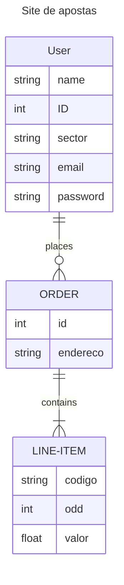

```mermaid

---
title: Site de apostas
---
erDiagram
    User ||--o{ ORDER : places
    User {
        string name
        int ID
        string sector
        string email
        string password
    }
    ORDER ||--|{ LINE-ITEM : contains
    ORDER {
        int id
        string endereco
    }
    LINE-ITEM {
        string codigo
        int odd
        float valor
    }


```