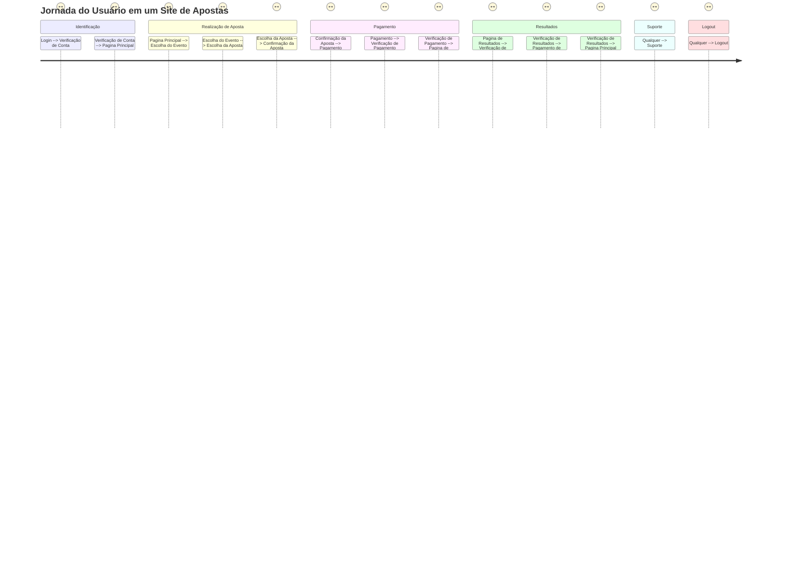

```mermaid

journey
    title Jornada do Usuário em um Site de Apostas

    section Identificação
        Login --> Verificação de Conta: O usuário insere suas credenciais e faz login.
        Verificação de Conta --> Pagina Principal: O sistema verifica a conta do usuário e o redireciona para a página principal.

    section Realização de Aposta
        Pagina Principal --> Escolha do Evento: O usuário navega pela página principal e escolhe um evento para apostar.
        Escolha do Evento --> Escolha da Aposta: O usuário seleciona o tipo de aposta que deseja realizar.
        Escolha da Aposta --> Confirmação da Aposta: O usuário define o valor da aposta e confirma sua escolha.

    section Pagamento
        Confirmação da Aposta --> Pagamento: O usuário insere suas informações de pagamento e finaliza a aposta.
        Pagamento --> Verificação de Pagamento: O sistema verifica o pagamento do usuário.
        Verificação de Pagamento --> Pagina de Resultados: O sistema redireciona o usuário para a página de resultados.

    section Resultados
        Pagina de Resultados --> Verificação de Resultados: O sistema verifica o resultado do evento.
        Verificação de Resultados --> Pagamento de Ganhos: Se o usuário ganhar a aposta, o sistema faz o pagamento dos ganhos para a conta do usuário.
        Verificação de Resultados --> Pagina Principal: Se o usuário perder a aposta, o sistema redireciona o usuário para a página principal.

    section Suporte
        Qualquer --> Suporte: O usuário entra em contato com o suporte para resolver qualquer problema.

    section Logout
        Qualquer --> Logout: O usuário faz logout da sua conta.
```